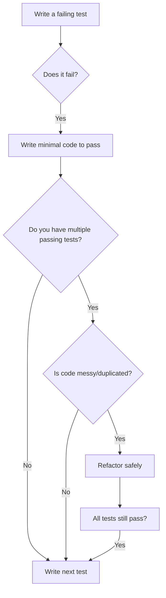

# STRING CALCULATOR TDD KATA

A Test-Driven Development implementation of the String Calculator kata in Ruby 

## About

This project demonstrates:
- Test-Driven Development (TDD).
- I've used the Red-Green-Refactor cycle strategy:
  - Writing tests first
  - Minimal code to pass the tests
  - Incremental development through frequent commits
- Clean code principles
- Comprehensive test coverage using RSpec

- ## Red-Green-Refactor cycle strategy:
  - Red: Write a new RSpec test for the next requirement and run rspec. The test should fail. This forces the developer to think about the desired behaviour:
    
    

  - Green: Write [just enough code](https://github.com/amd4k/string_calculator_kata/blob/58789d839aa7d4296fe31423e9c8b2507d6c5ecc/lib/string_calculator.rb) in the class to make the test pass. Keep it simple:
    
    

  - Continue this Red-Green cycle and Refactor (while ensuring all tests still pass) when required.
    - Before:
     
            
      
    - After:
     
      

## Developed using Ruby 3.3.9, Rails 8.0.3 on WSL for Windows 10 (Used 22.04.5 LTS Image)

